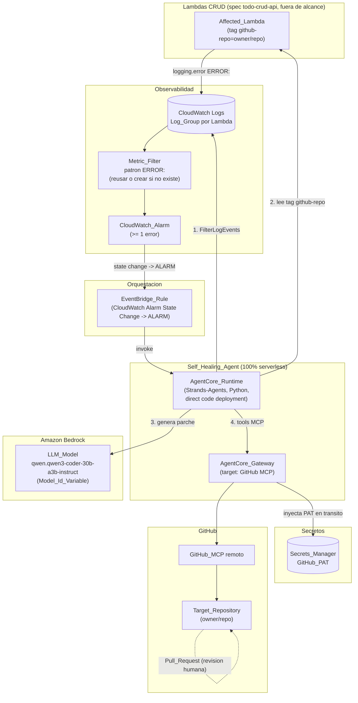
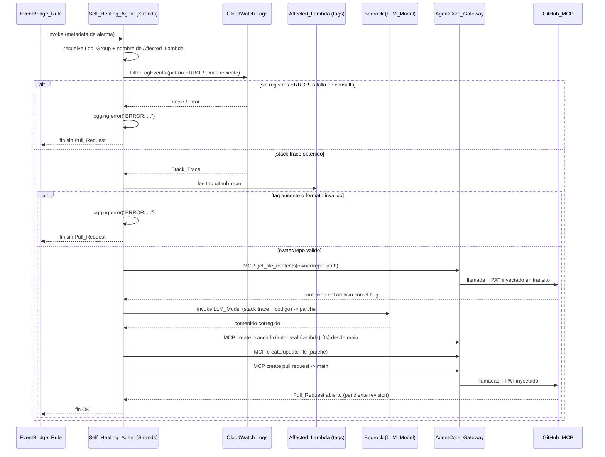

# Design Document

## Overview

Esta feature implementa el **Self_Healing_Agent**: un agente autónomo 100% serverless que se activa cuando una Lambda CRUD de la spec `todo-crud-api` registra un error, analiza el stack trace real desde CloudWatch Logs, genera un parche de código defensivo con un LLM en Amazon Bedrock y abre un Pull Request en GitHub para revisión humana obligatoria. El agente **nunca** hace merge automático.

El diseño cubre dos planos que conviven en el mismo repositorio:

1. **Plano de infraestructura (IaC_Stack, AWS CDK en Python):** el Metric_Filter y la CloudWatch_Alarm (creados solo si no existen ya en `todo-crud-api`), la EventBridge_Rule, el AgentCore_Runtime, el AgentCore_Gateway, el secreto de Secrets_Manager y los permisos IAM de mínimo privilegio.
2. **Plano de runtime del agente (Strands-Agents en Python):** el código del agente que ejecuta el ciclo ReAct (Detectar → Analizar → Identificar repo → Leer código → Generar parche → Abrir PR), invocando el LLM_Model vía Bedrock y las herramientas del GitHub_MCP exclusivamente a través del AgentCore_Gateway.

El flujo end-to-end es el descrito en `architecture-guide.md` §5 y en la introducción de `requirements.md`:

```
Lambda CRUD --ERROR:--> Log Group --Metric Filter--> Alarm --state ALARM-->
EventBridge Rule --invoke--> AgentCore Runtime (Strands + Qwen3 Coder)
   -> FilterLogEvents (stack trace)
   -> lee tag github-repo (owner/repo)
   -> AgentCore Gateway -> GitHub MCP (get_file_contents, create branch, create PR)
```

### Alcance

**Dentro de alcance:**
- Asociación de la CloudWatch_Alarm de `todo-crud-api` a una EventBridge_Rule que invoca al agente.
- Creación **idempotente** del Metric_Filter (`ERROR:`) y la CloudWatch_Alarm: solo si no los creó `todo-crud-api`, sin duplicar.
- Despliegue de AgentCore_Runtime (direct code deployment, sin contenedor/ECR), AgentCore_Gateway hacia el GitHub_MCP remoto, y el secreto del GitHub_PAT en Secrets_Manager.
- Código del agente Strands que ejecuta el ciclo ReAct completo, con `model_id` configurable por `Model_Id_Variable`.
- IAM de mínimo privilegio para el agente y el gateway.

**Fuera de alcance:**
- Código y despliegue de las Lambdas CRUD, su tabla DynamoDB, API Gateway y el catálogo de errores sembrados (spec `todo-crud-api`).
- La creación del GitHub_PAT en sí (se aprovisiona el secreto y se documenta la carga del valor de forma manual/externa; el token no se versiona en el repo).
- Configuración del repositorio de GitHub (protección de rama `main`, revisores). Se documenta como recomendación operativa.

### Hallazgos de investigación que informan el diseño

- **Disponibilidad del LLM_Model.** `qwen.qwen3-coder-30b-a3b-instruct` (Qwen3 Coder 30B A3B) está disponible en Amazon Bedrock como oferta **totalmente gestionada y serverless** desde el 18/09/2025, e incluye la región **Europa (Irlanda) `eu-west-1`**, que es la región de despliegue del proyecto ([anuncio AWS](https://aws.amazon.com/about-aws/whats-new/2025/09/qwen3-models-fully-managed-amazon-bedrock), [model card](https://docs.aws.amazon.com/bedrock/latest/userguide/model-card-qwen-qwen3-coder-30b-a3b-instruct.html)). Es un modelo Mixture-of-Experts (30B totales / 3B activos) orientado a *agentic coding* y tareas de generación de código, por lo que es adecuado para análisis de errores y generación de parches. *Contenido reformulado para cumplir restricciones de licencia.*
- **Idoneidad y riesgo.** El modelo es apto para el caso de uso, pero al ser un modelo de código relativamente compacto puede ofrecer menor calidad de razonamiento en stack traces muy complejos frente a modelos de mayor tamaño (p. ej. Qwen3-Coder-480B o Claude Sonnet, que el steering menciona como alternativa). Dado que el requisito exige `model_id` configurable por `Model_Id_Variable`, esta limitación se mitiga por diseño: se puede cambiar el modelo sin redeploy de código. Se documenta como consideración de diseño en la sección de riesgos.
- **Empaquetado del AgentCore_Runtime.** El AgentCore Runtime tradicionalmente requería empaquetar el agente como imagen de contenedor **ARM64 en ECR** ([requisitos custom](https://docs.aws.amazon.com/bedrock-agentcore/latest/devguide/getting-started-custom.html)), lo que colisionaría con la prohibición de ECR del steering. Desde nov-2025 AgentCore Runtime soporta **direct code deployment**: se empaqueta el código Python + dependencias en un `.zip`, se sube a S3 y se configura el runtime, **sin construir ni gestionar imágenes de contenedor** ([direct code deployment Python](https://docs.aws.amazon.com/bedrock-agentcore/latest/devguide/runtime-get-started-code-deploy-python.html)). Este diseño adopta **direct code deployment** para cumplir la restricción "sin ECR" y mantener el modelo 100% serverless (responsabilidad compartida análoga a AWS Lambda). *Contenido reformulado para cumplir restricciones de licencia.*

## Architecture

### Diagrama de componentes



### Flujo del ciclo ReAct del agente



### Decisiones de arquitectura y justificación

- **Detección por Metric_Filter + Alarm + EventBridge (no Subscription Filter).** Se mantiene la decisión de alcance de `architecture-guide.md` §6: el cambio de estado de la CloudWatch_Alarm es un evento nativo de EventBridge, lo que evita una Lambda enrutadora adicional. El evento solo trae metadata; el stack trace se recupera después con `FilterLogEvents`.
- **Creación idempotente de la observabilidad.** `todo-crud-api` (según su `stateless_stack.py`) **ya crea** Log Group, Metric Filter (`FilterPattern.literal('"ERROR:"')`, namespace `TodoCrudApi/Errors`) y Alarm por cada una de las 5 Lambdas. Por tanto, en el escenario real de este repo el IaC_Stack de esta feature **reutiliza** esos recursos (Req 1.3) referenciándolos por nombre/ARN, y **solo** crearía Metric_Filter/Alarm si no existieran (Req 1.1, 1.2). El mecanismo de decisión es en tiempo de síntesis de CDK (condicional Python + lookup/flag de contexto), no `CfnCondition` (iac-standards §5).
- **Una EventBridge_Rule por Alarm (o una regla con patrón que cubra las 5 alarmas).** La regla filtra el evento `CloudWatch Alarm State Change` cuyo `detail.state.value == "ALARM"` y cuyo `detail.alarmName` corresponde a las alarmas de las Lambdas CRUD. El target es el AgentCore_Runtime.
- **AgentCore_Runtime con direct code deployment.** Se empaqueta el agente Strands (Python) en `.zip` sin contenedor ni ECR, cumpliendo la prohibición del steering y manteniendo el modelo serverless. La invocación desde EventBridge se realiza vía el API de invocación del runtime (el target de EventBridge apunta al runtime a través de su ARN, con rol IAM que permite `InvokeAgentRuntime`).
- **AgentCore_Gateway como frontera de seguridad del PAT.** El agente **nunca** ve el GitHub_PAT: invoca herramientas MCP a través del Gateway, que recupera el secreto de Secrets_Manager y lo inyecta en tránsito (Req 7). Solo el rol del Gateway tiene `secretsmanager:GetSecretValue` sobre el secreto; el rol del agente **no** (Req 11.3, 11.5).
- **`model_id` externalizado.** El agente lee `Model_Id_Variable` del entorno del runtime; si no está definida, usa el default `qwen.qwen3-coder-30b-a3b-instruct` (Req 4). Ningún otro literal de modelo aparece en el código.
- **Resolución de repositorio solo por tag.** El agente lee el tag `github-repo` de la Affected_Lambda vía `lambda:ListTags` / `resourcegroupstaggingapi` y nunca enumera repositorios (Req 6).
- **Prohibición de merge automático.** El agente solo dispone de herramientas MCP de lectura de archivos, creación de rama, escritura de archivo y creación de PR. No se habilita ninguna herramienta de merge/approve, ni flag que la active (Req 10).

### Estructura de directorios propuesta

```
services/self_healing_agent/          # runtime del agente (Strands, Python 3.13)
  agent.py                            # entrypoint AgentCore (/invocations, /ping) + ciclo ReAct
  config.py                           # lectura de Model_Id_Variable y default
  repo_tag.py                         # parseo/validacion del tag github-repo -> owner/repo
  branch_naming.py                    # generacion de nombre Fix_Branch
  logs_client.py                      # consulta CloudWatch Logs (FilterLogEvents)
  requirements.txt                    # strands-agents, bedrock-agentcore, boto3 (pins exactos)
  requirements-dev.txt                # pytest, hypothesis (pins exactos)
  tests/
    test_repo_tag.py
    test_branch_naming.py
    test_agent_flow.py                # tests de flujo con mocks
    test_properties.py                # PBT (logica pura)

infra/
  stacks/
    agent_stack.py                    # IaC_Stack de esta feature (nuevo)
  constructs/
    observability_wiring.py           # reuse/crea Metric_Filter + Alarm (idempotente)
    agent_runtime.py                  # AgentCore Runtime (direct code deploy) + rol IAM
    agent_gateway.py                  # AgentCore Gateway -> GitHub MCP + rol IAM
  tests/
    test_agent_stack.py               # aws_cdk.assertions
```

> El `agent_stack.py` se añade en `app.py` como un stack sin estado adicional (separación stateful/stateless de iac-standards §5), en la región `eu-west-1`.

## Components and Interfaces

### 1. Observability Wiring (CDK)

- **Responsabilidad:** garantizar que existan el Metric_Filter (`ERROR:`) y la CloudWatch_Alarm por cada Log_Group de Lambda CRUD, sin duplicar.
- **Comportamiento idempotente:**
  - Si `todo-crud-api` ya los creó (caso real de este repo), se referencian por nombre (`cloudwatch.Alarm.from_alarm_arn` / `logs.LogGroup.from_log_group_name`) para conectarlos a EventBridge.
  - Si no existen (flag de contexto `create_observability=true`), se crean con `filter_pattern=logs.FilterPattern.literal('"ERROR:"')`, `threshold=1`, `evaluation_periods=1`, `comparison_operator=GREATER_THAN_OR_EQUAL_TO_THRESHOLD`, `treat_missing_data=NOT_BREACHING`, idénticos a los de `todo-crud-api` para no divergir del contrato del patrón.
- **Contrato del patrón:** el literal `ERROR:` es compartido con el logging de las Lambdas; no se altera sin cambiar ambos lados.

### 2. EventBridge Rule (CDK)

- **Tipo:** `events.Rule` con `event_pattern`:
  ```python
  event_pattern = events.EventPattern(
      source=["aws.cloudwatch"],
      detail_type=["CloudWatch Alarm State Change"],
      detail={
          "alarmName": [<nombres de las alarmas CRUD>],
          "state": {"value": ["ALARM"]},
      },
  )
  ```
- **Target:** el AgentCore_Runtime (a través de su ARN de invocación), con un rol IAM que permita a EventBridge invocar el runtime. El evento entregado contiene la metadata (`alarmName`, `state`, `configuration`) desde la cual el agente deriva el Log_Group y la Affected_Lambda.
- **Restricción negativa (Req 2.4):** el `state.value == "ALARM"` en el patrón evita invocar al agente en transiciones a `OK`/`INSUFFICIENT_DATA`.

### 3. AgentCore Runtime (CDK + código Strands)

- **Despliegue (CDK):** recurso AgentCore Runtime configurado con **direct code deployment** (código Python en `.zip` sobre S3), arquitectura ARM64, `Model_Id_Variable` como variable de entorno, y un rol de ejecución de mínimo privilegio.
- **Entrypoint (código):** el agente expone el contrato de AgentCore Runtime (endpoints `/invocations` POST y `/ping` GET) mediante el SDK `bedrock-agentcore` + `strands-agents`.
- **Ciclo ReAct (código):** implementa los pasos de `architecture-guide.md` §5 en orden. Interfaz lógica principal:

  ```python
  def handle_event(event: dict) -> dict:
      """Punto de entrada invocado por AgentCore Runtime.
      1. Deriva Log_Group y nombre de Affected_Lambda desde la metadata (Req 5.1).
      2. Obtiene el Stack_Trace mas reciente con FilterLogEvents (Req 5.2).
         - Si no hay ERROR: o falla la consulta -> log ERROR: y termina (Req 5.3, 5.4).
      3. Lee el tag github-repo -> owner/repo (Req 6).
         - Si falta o es invalido -> log ERROR: y termina (Req 6.5).
      4. Lee el archivo fuente via MCP get_file_contents (Req 8.1).
      5. Invoca el LLM_Model (Model_Id_Variable) para generar el parche (Req 4.4, 8.2, 8.3).
      6. Crea Fix_Branch, escribe parche y abre Pull_Request via MCP (Req 9).
         - Cualquier fallo -> log ERROR: y termina sin bloquear reintentos (Req 9.5).
      """
  ```

- **Herramientas del agente (Strands tools):** envoltorios que invocan herramientas del GitHub_MCP **a través del AgentCore_Gateway** (nunca directamente contra GitHub). El agente no recibe el PAT.

### 4. AgentCore Gateway (CDK)

- **Responsabilidad:** actuar como intermediario autenticado entre el agente y el GitHub_MCP remoto, recuperando el GitHub_PAT de Secrets_Manager e inyectándolo en tránsito (Req 7.1, 7.3).
- **Target:** el endpoint del GitHub_MCP remoto oficial.
- **Credencial saliente:** configuración de credencial del gateway que referencia el secreto de Secrets_Manager (el gateway asume un rol con `secretsmanager:GetSecretValue` limitado a ese ARN).
- **Frontera de seguridad:** es el único componente con acceso al secreto. Si no puede recuperarlo, la llamada MCP falla y el agente registra `ERROR:` y termina sin PR (Req 7.5).

### 5. Secrets Manager (CDK)

- **Recurso:** `secretsmanager.Secret` que contiene el GitHub_PAT (Req 7.2). El valor real **no** se define en el código CDK (no se hardcodea el secreto); se aprovisiona el recurso y el valor se carga fuera de banda.
- **Acceso:** solo el rol del AgentCore_Gateway obtiene `grant_read` (Req 11.3). El rol del agente **no** recibe permiso sobre este secreto (Req 11.5).

### 6. Componentes de lógica pura del agente (unidad testeable)

- **`repo_tag.parse_repo_tag(tags: dict) -> RepoRef`** — extrae el valor de `github-repo` y valida el formato `owner/repo`. Lanza `InvalidRepoTagError` si falta o el formato es inválido (Req 6.2, 6.5).
- **`branch_naming.build_fix_branch_name(lambda_name: str, timestamp: datetime) -> str`** — construye `fix/auto-heal-{lambda}-{timestamp}` de forma determinista, saneando caracteres no válidos para nombres de rama de Git (Req 9.1).
- **`config.resolve_model_id(env: Mapping[str, str]) -> str`** — devuelve `env["Model_Id_Variable"]` o el default `qwen.qwen3-coder-30b-a3b-instruct` (Req 4.1, 4.2).

Estos tres son funciones puras y constituyen la superficie principal de property-based testing (ver Testing Strategy).

## Data Models

### Evento de entrada (CloudWatch Alarm State Change vía EventBridge)

Estructura relevante que el agente consume (metadata, sin stack trace):

```json
{
  "source": "aws.cloudwatch",
  "detail-type": "CloudWatch Alarm State Change",
  "detail": {
    "alarmName": "TodoCrudStatelessStack-AlarmCreate...",
    "state": { "value": "ALARM", "reason": "Threshold Crossed..." },
    "configuration": {
      "metrics": [
        { "metricStat": { "metric": {
            "namespace": "TodoCrudApi/Errors",
            "name": "CreateErrorCount" } } }
      ]
    }
  }
}
```

El agente deriva de esta metadata el nombre de la Affected_Lambda y su Log_Group (`/aws/lambda/{function_name}`).

### RepoRef (resultado de parsear el tag `github-repo`)

| Campo   | Tipo   | Descripción |
|---------|--------|-------------|
| `owner` | string | Parte antes de `/`. No vacía. |
| `repo`  | string | Parte después de `/`. No vacía. |

- **Formato válido:** exactamente un `/`, con `owner` y `repo` no vacíos, sin espacios en blanco al inicio/fin. Ej.: `David1187/hackaton-kiro-agente-cloudwatch`.
- **Formato inválido (→ `InvalidRepoTagError`, Req 6.5):** ausencia del tag, cadena vacía, sin `/`, múltiples `/`, `owner` o `repo` vacíos.

### Fix_Branch (nombre de rama de corrección)

- **Patrón:** `fix/auto-heal-{lambda}-{timestamp}`.
- `{lambda}`: nombre de la Affected_Lambda saneado (caracteres válidos para ref de Git).
- `{timestamp}`: marca temporal UTC en formato compacto (p. ej. `20250115T103045Z`), que garantiza unicidad entre ejecuciones.
- **Base:** siempre `main` (Req 9.1).

### Pull_Request (metadata que produce el agente)

| Campo         | Contenido |
|---------------|-----------|
| `head`        | Fix_Branch |
| `base`        | `main` |
| `title`       | Resumen breve del fix (ej. `fix(auto-heal): manejo defensivo en {lambda}`). |
| `description` | Referencia a la Affected_Lambda + resumen del error detectado (Req 9.4). |
| `state`       | `open` (pendiente de revisión humana; nunca merged/approved por el agente — Req 10). |

### Variables de entorno del AgentCore_Runtime

| Variable | Formato | Uso |
|----------|---------|-----|
| `Model_Id_Variable` | id de modelo Bedrock | LLM_Model a invocar; default `qwen.qwen3-coder-30b-a3b-instruct` (Req 4). |

> **No** se define ninguna variable de entorno con el GitHub_PAT (Req 7.4). El token vive solo en Secrets_Manager y lo maneja el Gateway.

## Correctness Properties

*Una propiedad es una característica o comportamiento que debe cumplirse en todas las ejecuciones válidas del sistema: en esencia, una afirmación formal sobre lo que el sistema debe hacer. Las propiedades sirven de puente entre las especificaciones legibles por humanos y las garantías de corrección verificables por máquina.*

La mayor parte de esta feature es infraestructura (CDK) y orquestación con dependencias externas (Bedrock, CloudWatch Logs, GitHub MCP a través del Gateway), que **no** son amenables a property-based testing y se validan con snapshot/assertions de CDK y tests basados en mocks/integración (ver Testing Strategy). Las propiedades siguientes se limitan a la **lógica pura** del runtime del agente, que sí tiene un espacio de inputs amplio y "for all" significativos. Se prueban de forma aislada, sin invocar servicios de AWS ni GitHub.

### Property 1: Resolución del identificador del modelo

*For any* mapa de variables de entorno, `resolve_model_id` devuelve el valor de `Model_Id_Variable` cuando está presente y no vacío, y en cualquier otro caso devuelve exactamente el default `qwen.qwen3-coder-30b-a3b-instruct`.

**Validates: Requirements 4.1, 4.2**

### Property 2: Round-trip y rechazo del tag `github-repo`

*For any* par `owner` y `repo` no vacíos y sin `/` ni espacios, `parse_repo_tag({"github-repo": f"{owner}/{repo}"})` devuelve exactamente `(owner, repo)`; y *for any* cadena que no tenga exactamente un `/` con ambas partes no vacías (incluida la ausencia del tag), `parse_repo_tag` lanza `InvalidRepoTagError` sin devolver un Target_Repository.

**Validates: Requirements 6.2, 6.5**

### Property 3: Derivación del Log_Group desde la metadata de la alarma

*For any* metadata de alarma válida que identifique una Affected_Lambda con un `function_name`, la derivación del Log_Group produce exactamente `/aws/lambda/{function_name}`.

**Validates: Requirements 5.1**

### Property 4: Formato y validez del nombre de la Fix_Branch

*For any* nombre de Affected_Lambda y *for any* timestamp, `build_fix_branch_name` produce un nombre que comienza por `fix/auto-heal-`, incorpora el timestamp, y es un nombre de rama de Git válido (sin espacios ni caracteres prohibidos); y dos timestamps distintos producen nombres distintos.

**Validates: Requirements 9.1**

### Property 5: El cuerpo del Pull_Request referencia la Affected_Lambda y el error

*For any* nombre de Affected_Lambda y *for any* resumen de error, la descripción del Pull_Request generada contiene tanto el nombre de la Affected_Lambda como el resumen del error detectado.

**Validates: Requirements 9.4**

## Error Handling

### Principio general

El agente aplica la misma programación defensiva exigida a las Lambdas CRUD (`architecture-guide.md` §3): cada paso de I/O (CloudWatch Logs, lectura de tags, invocación del LLM, herramientas MCP vía Gateway) va envuelto en `try-except`. Ante cualquier fallo, el agente registra el problema con el prefijo `ERROR:` y **finaliza de forma limpia sin abrir ni dejar a medias un Pull_Request**. El propio logging del agente con `ERROR:` es coherente con el contrato del Metric_Filter (un fallo del agente también es observable).

### Mapa de fallos → comportamiento

| Situación | Requisito | Comportamiento del agente |
|-----------|-----------|---------------------------|
| No hay registros con `ERROR:` en el Log_Group | 5.3 | Registrar ausencia de stack trace; terminar sin PR. |
| La consulta a CloudWatch Logs falla | 5.4 | `logging.error("ERROR: ...", exc_info=True)`; terminar sin PR. |
| Tag `github-repo` ausente o con formato inválido | 6.5 | `InvalidRepoTagError` → log `ERROR:`; terminar sin PR. |
| El Gateway no puede recuperar el GitHub_PAT | 7.5 | La tool MCP falla por credencial → log `ERROR:`; terminar sin PR. |
| Falla la creación de rama / escritura / apertura del PR | 9.5 | Log `ERROR:`; terminar sin dejar el repo en estado que impida reintentos (el timestamp en el nombre de rama evita colisiones en reintentos posteriores). |
| Falla la invocación del LLM_Model en Bedrock | 4.4 (implícito) | Log `ERROR:`; terminar sin PR. |

### Garantías de seguridad ante errores

- **El PAT nunca se registra ni se expone.** Los mensajes `ERROR:` del agente no contienen el token (el agente no lo posee). Cualquier error de credencial se percibe como un fallo genérico de la tool MCP.
- **Idempotencia de reintentos (9.5):** como cada ejecución genera una Fix_Branch con timestamp único, un reintento tras un fallo parcial no colisiona con ramas anteriores ni deja el Target_Repository bloqueado.
- **Sin merge automático incluso en errores:** ninguna rama de manejo de errores habilita merge/approve (Req 10).

## Testing Strategy

### Enfoque dual

- **Property-based tests (lógica pura del agente):** cubren las 5 propiedades de la sección anterior. Se ejecutan sobre funciones puras (`resolve_model_id`, `parse_repo_tag`, derivación de Log_Group, `build_fix_branch_name`, construcción del cuerpo del PR) sin tocar AWS ni GitHub.
- **Unit tests basados en ejemplos y edge cases:** cubren los caminos de error del flujo (5.3, 5.4, 7.5, 9.5) y las restricciones negativas de comportamiento (6.3, 6.4, 8.3, 10.x) usando mocks/spies de las tools MCP, del cliente de CloudWatch Logs, del cliente de tags y del cliente de Bedrock.
- **Tests de infraestructura (`aws_cdk.assertions`):** cubren toda la configuración IaC (SMOKE/EXAMPLE de la prework): Metric_Filter, Alarm, EventBridge_Rule (event_pattern con `state.value=ALARM`), target al runtime, existencia del secreto, roles IAM de mínimo privilegio, y **ausencia** de recursos ECS/Fargate/EC2/ECR (Req 3.4) y de `GetSecretValue` en el rol del agente (Req 11.5).
- **Tests de integración (1–3 ejemplos):** comportamiento de servicios externos que no varía significativamente con el input: transición de la Alarm (1.4), transporte de metadata por EventBridge (2.3), consulta real a Logs (5.2), inyección del PAT por el Gateway (7.3), y calidad del parche generado por el LLM (8.2) evaluada con ejemplos representativos.

### Justificación de por qué PBT se limita a la lógica pura

- La infraestructura CDK es declarativa: no es una función con inputs/outputs, por lo que se valida con snapshot/assertions (iac-standards §4), no con PBT.
- La integración con Bedrock, CloudWatch Logs y el GitHub_MCP depende de servicios externos y de la salida no determinista del LLM; 100+ iteraciones no aportan más que 1–3 ejemplos y tendrían coste elevado. Se usan mocks para los tests unitarios y ejemplos para los de integración.
- Las restricciones negativas de seguridad (no ver el PAT, no mergear, no enumerar repos) se verifican por estructura del toolset y por assertions de IAM, no como propiedades universales de ejecución.

### Configuración de los property-based tests

- **Librería:** `hypothesis` (Python), consistente con el resto del repo (ya presente en `services/crud_api`). **No** se implementa PBT desde cero.
- **Iteraciones:** mínimo **100** por propiedad (`@settings(max_examples=100)` o superior).
- **Etiquetado:** cada test de propiedad se anota con un comentario que referencia la propiedad de diseño, con el formato:
  `# Feature: self-healing-agent, Property {número}: {texto de la propiedad}`
- **Cobertura:** una única prueba de propiedad por cada propiedad de diseño (P1–P5).

### Tests de infraestructura (mínimos)

Siguiendo iac-standards §4, `test_agent_stack.py` verifica al menos:
- `Template.from_stack(agent_stack)` contiene la EventBridge_Rule con el `EventPattern` correcto (`detail.state.value = ["ALARM"]`).
- El target de la regla apunta al AgentCore_Runtime y existe el rol con permiso de invocación.
- Existe el `AWS::SecretsManager::Secret` del PAT; el rol del Gateway tiene `GetSecretValue` sobre su ARN y el rol del agente **no**.
- El rol del agente tiene `bedrock:InvokeModel` y permisos de lectura de Logs limitados a los Log_Groups CRUD, y `lambda:ListTags`/`tag:GetResources` para el tag.
- `resource_count_is` == 0 para `AWS::ECS::*`, `AWS::EC2::Instance` y `AWS::ECR::*`.
- En modo reuse, no se sintetizan Metric_Filter/Alarm duplicados; en modo create, sí.

## Consideraciones y Riesgos de Diseño

- **Idoneidad del LLM_Model (Qwen3 Coder 30B A3B).** Confirmado disponible y serverless en Bedrock `eu-west-1` y orientado a *agentic coding*, por lo que es adecuado para el caso de uso. Riesgo: al ser un modelo compacto (3B activos), la calidad del parche en stack traces complejos puede ser inferior a modelos mayores (Qwen3-Coder-480B) o a Claude Sonnet (alternativa citada en el steering). **Mitigación por diseño:** el `model_id` es configurable vía `Model_Id_Variable` sin redeploy de código (Req 4), de modo que puede escalarse a un modelo superior si la calidad no es suficiente. El default se mantiene en `qwen.qwen3-coder-30b-a3b-instruct` según el requisito.
- **Empaquetado del AgentCore_Runtime sin ECR.** AgentCore Runtime tradicionalmente exige imagen de contenedor ARM64 en ECR, lo que colisionaría con la prohibición de ECR del steering. Este diseño usa **direct code deployment** (zip + S3), disponible desde nov-2025, para cumplir "100% serverless sin ECR". Riesgo: es una capacidad reciente; si el soporte L2 de CDK para AgentCore Runtime con direct code deployment no está maduro, la fase de implementación deberá usar un escape hatch L1 (`Cfn*`) o un custom resource, documentándolo. Se debe verificar la versión de `aws-cdk-lib` y el soporte del recurso en el momento de implementar (iac-standards §7).
- **Divergencia del contrato `ERROR:`.** El Metric_Filter depende del literal `ERROR:`. Si `todo-crud-api` cambia el prefijo de logging, la detección se rompe. Se documenta como contrato compartido; el modo reuse referencia los recursos existentes de `todo-crud-api` para no divergir.
- **Alcance del PAT.** Aunque el agente nunca ve el token, el PAT debe crearse con permisos de repositorio mínimos (contenido + PRs sobre el Target_Repository). Se recomienda un fine-grained PAT restringido al repositorio objetivo. La carga del valor del secreto es una operación fuera de banda (no versionada).
- **Protección de rama `main`.** Para reforzar la revisión humana obligatoria (Req 10) a nivel de plataforma, se recomienda configurar branch protection en `main` del Target_Repository exigiendo aprobación de PR. Es una recomendación operativa fuera del alcance del IaC de este stack.
