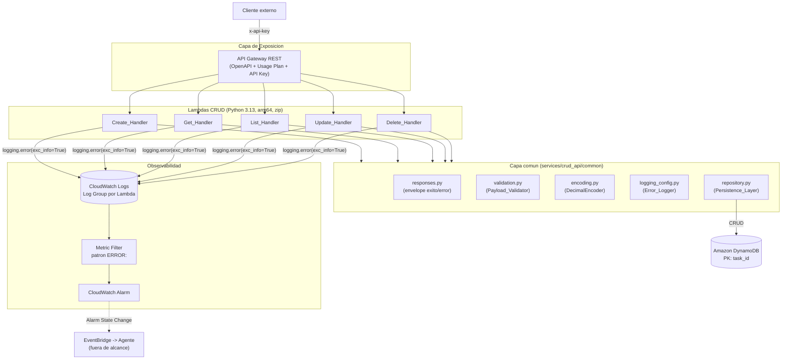
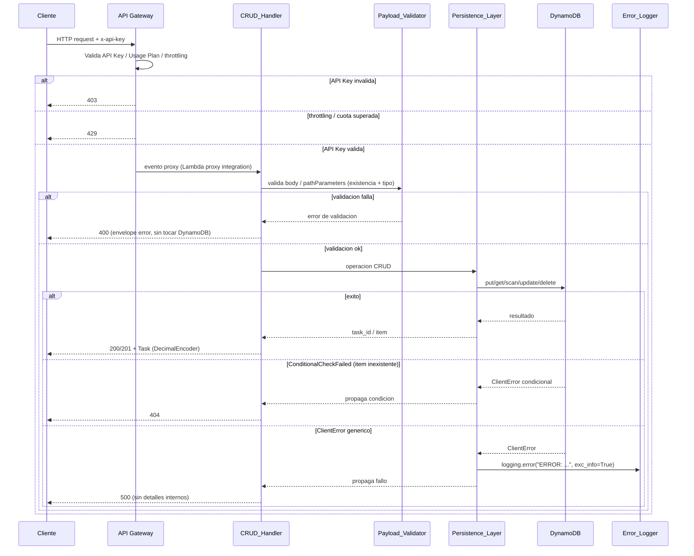

# Design Document

## Overview

Este documento describe el diseño de `todo-crud-api`: una API CRUD para gestionar una lista de tareas (Tasks), implementada con funciones AWS Lambda en Python 3.13 que persisten directamente en Amazon DynamoDB y se exponen mediante Amazon API Gateway (REST API) protegido con Usage Plan + API Key. Todo el despliegue es 100% serverless mediante AWS CDK en Python (sin contenedores ni ECR).

El diseño da servicio a dos objetivos que conviven en el mismo repositorio y que el lector debe entender como capas separadas, no contradictorias:

1. **Comportamiento_Objetivo (Requisitos 1–9):** el comportamiento correcto, defensivo y observable al que debe converger el código. Es el **estado final** esperado tras la reparación por parte del Agente de auto-reparación. **No es el estado desplegado.**
2. **Código_Sembrado (Requisitos 10–11):** el catálogo de errores comunes sembrados de forma determinista en las Lambdas CRUD para que el Agente de auto-reparación tenga fallos reales que detectar y corregir vía Pull Request. **Es el código actualmente desplegado**, de forma permanente y deliberada para la demo del Hackathon.

> **Decisión de alcance vigente:** los Seeded_Errors están **fusionados dentro de los handlers desplegados** (`services/crud_api/handlers/`), no aislados en una carpeta aparte sin desplegar. El paquete `services/crud_api/seeded/`, que conservaba cada error por separado, se eliminó por redundante: la documentación de referencia del catálogo es la sección 6 de este documento, y la fuente de verdad operativa de los payloads de disparo es `services/crud_api/DEMO_ERRORS.md`.

Ambas capas comparten la misma arquitectura de infraestructura, el mismo contrato de API y el mismo modelo de datos; se diferencian únicamente en la implementación interna de los handlers (defensiva vs. sembrada). La infraestructura de observabilidad que se diseña aquí (Log Group + Metric Filter sobre el patrón `ERROR:` + Alarm) es la que conecta este spec con el flujo del Agente, aunque la infraestructura del Agente en sí queda fuera de alcance (definida en `architecture-guide.md`).

### Alcance

**Dentro de alcance:**
- Cinco handlers CRUD (Create, Get, List, Update, Delete) en Python.
- Capa común compartida (`services/crud_api/common/`): helpers de respuesta HTTP, validación de payloads, codificador JSON de `Decimal`, configuración de logging.
- Tabla DynamoDB con `task_id` como clave de partición.
- API Gateway REST definido con OpenAPI + Usage Plan + API Key.
- Wiring de observabilidad: Log Group, Metric Filter (`ERROR:`) y Alarm de CloudWatch.
- Tag `github-repo` (`owner/repo`) en cada Lambda CRUD.
- Catálogo de errores sembrados (desplegado de forma permanente) y su documentación de payloads.

**Fuera de alcance:**
- Infraestructura y código del Agente de auto-reparación (Bedrock AgentCore, Gateway, Secrets Manager, EventBridge → Agente).
- Autenticación distinta de API Key (IAM/Cognito), por decisión de alcance del Hackathon.

## Architecture

### Diagrama de componentes



### Flujo de una petición (Comportamiento_Objetivo)



### Decisiones de arquitectura y justificación

- **Una Lambda por operación CRUD (5 funciones).** Permite (a) asignar permisos IAM de mínimo privilegio por operación (p. ej. el List no necesita `DeleteItem`), (b) tener un Log Group independiente por handler, lo que facilita que el Agente aísle el stack trace del handler que falló al leer un único Log Group, y (c) aislar cada Seeded_Error en su handler (Requisito 10.5). Alternativa descartada: un único "monolambda" con router interno, que dificultaría el aislamiento de errores sembrados y el mínimo privilegio.
- **Lambda proxy integration.** El API Gateway entrega el evento completo (body, `pathParameters`, headers) al handler, y el handler devuelve el envelope `{statusCode, headers, body}`. Esto encaja con el formato de respuesta obligatorio del steering (`backend-standards.md` §2) y hace que el `pathParameters` sea accesible directamente en el evento (relevante para los Seeded_Errors 11.3).
- **Capa común compartida (`services/crud_api/common/`).** Centraliza el envelope de respuesta, la validación, el `DecimalEncoder` y la configuración de logging, evitando duplicación (steering §2). Nota importante para la demo: la capa común representa el **Comportamiento_Objetivo**; el **Código_Sembrado** de cada handler deliberadamente **no** usa (o usa mal) estos helpers para reproducir el error del catálogo. La reparación del Agente consiste, esencialmente, en reconducir cada handler a usar la capa común.
- **Empaquetado zip + arm64, sin contenedores.** Cumple `architecture-guide.md` §3 y §2. Python 3.13 fijo (steering `backend-standards.md` §8).
- **Observabilidad por Metric Filter, no Subscription Filter.** Se adopta el flujo "Log Group → Metric Filter (`ERROR:`) → Alarm → EventBridge" definido como decisión deliberada de alcance (`architecture-guide.md` §6). El patrón `ERROR:` es un contrato compartido: el logging de los handlers y el Metric Filter deben mantenerse sincronizados.
- **Cliente boto3 a nivel de módulo.** Reutiliza conexión entre invocaciones en warm starts (steering §3).

### Estructura de directorios propuesta

```
services/crud_api/
  common/
    __init__.py
    responses.py          # success_response / error_response (envelope estandar)
    validation.py         # validacion title/completed/task_id (Payload_Validator)
    encoding.py           # DecimalEncoder (json.JSONEncoder)
    logging_config.py     # configure_logger() -> logger con formato "ERROR: ..."
    repository.py         # TaskRepository (Persistence_Layer sobre DynamoDB)
  handlers/
    create_task.py        # Create_Handler — contiene SE-1, SE-2, SE-8, SE-10, SE-11 (desplegado)
    get_task.py           # Get_Handler — contiene SE-3, SE-9, SE-12, SE-13 (desplegado)
    list_tasks.py         # List_Handler — contiene SE-4, SE-14, SE-15 (desplegado)
    update_task.py        # Update_Handler — contiene SE-5, SE-6, SE-16, SE-17 (desplegado)
    delete_task.py        # Delete_Handler — contiene SE-7, SE-18, SE-19 (desplegado)
  DEMO_ERRORS.md          # FUENTE DE VERDAD operativa: payloads de disparo (Req 10.7)
  requirements.txt        # runtime (boto3 pin exacto)
  requirements-dev.txt    # pytest, moto, hypothesis, bandit (pins exactos)
  tests/
    test_create_task.py
    test_get_task.py
    test_list_tasks.py
    test_update_task.py
    test_delete_task.py
    test_properties.py    # tests basados en propiedades (PBT)
```

> La infraestructura CDK (`infra/`, `app.py`) que despliega estas Lambdas, la tabla, el API Gateway y la observabilidad es responsabilidad del agente de IaC y se describe a nivel de contrato en la sección de Componentes; su implementación concreta queda para la fase de tareas.

## Components and Interfaces

### 1. API Gateway (REST API)

- **Tipo:** REST API definido con OpenAPI (Requisito 8.1).
- **Autenticación:** Usage Plan + API Key. `apiKeyRequired: true` en cada método (Requisito 8.2).
- **Rutas y métodos:**

  | Operación | Método | Ruta              | Handler        | Éxito |
  |-----------|--------|-------------------|----------------|-------|
  | Crear     | POST   | `/tasks`          | Create_Handler | 201   |
  | Listar    | GET    | `/tasks`          | List_Handler   | 200   |
  | Consultar | GET    | `/tasks/{task_id}`| Get_Handler    | 200   |
  | Actualizar| PUT    | `/tasks/{task_id}`| Update_Handler | 200   |
  | Eliminar  | DELETE | `/tasks/{task_id}`| Delete_Handler | 200   |

- **Usage Plan (Requisito 8.5):** rate = 100 req/s, burst = 200, quota = 10.000 req/día.
- **Comportamiento de rechazo:** 403 para API Key ausente/inválida (8.2); 429 al superar rate/quota (8.6); ruta/método no definidos se rechazan sin invocar Lambda (8.4). Estos comportamientos los provee el propio API Gateway, no el código Lambda.

### 2. CRUD Handlers (Lambda)

Todos los handlers (Comportamiento_Objetivo) comparten el mismo esqueleto defensivo:

```python
import json
import logging
from common import responses, validation, encoding
from common.repository import TaskRepository
from common.logging_config import configure_logger

logger = configure_logger(__name__)          # nivel de modulo
repo = TaskRepository()                        # nivel de modulo (boto3 warm reuse)

def handler(event, context):
    try:
        # 1. Parseo + validacion de entrada (Payload_Validator) -> 400 si falla
        # 2. Operacion contra DynamoDB via TaskRepository (Persistence_Layer)
        # 3. Respuesta de exito con envelope estandar
        ...
    except validation.ValidationError as e:
        return responses.error_response(400, e.code, e.message)
    except TaskRepository.NotFoundError:
        return responses.error_response(404, "RESOURCE_NOT_FOUND", "La Task no existe.")
    except Exception:
        logger.error("ERROR: fallo no controlado en el handler", exc_info=True)
        return responses.error_response(500, "INTERNAL_ERROR", "Error interno inesperado.")
```

Responsabilidades específicas:

- **Create_Handler (Req 1):** parsea body JSON, valida `title` (string, 1–255 tras `strip`) y `completed` (bool opcional, default `false`), genera `task_id` (`uuid4`), fija `created_at`/`updated_at` (mismo instante), persiste con `put_item`, responde 201 con la Task.
- **Get_Handler (Req 2):** valida `task_id` (presente, 1–256 chars), `get_item`, 404 si no existe `Item`, 200 con la Task serializada con `DecimalEncoder`.
- **List_Handler (Req 3):** `scan` con límite de 1000 elementos, 200 con colección (vacía si no hay Tasks), serializa con `DecimalEncoder`. La autenticación (403) la maneja API Gateway.
- **Update_Handler (Req 4):** valida `task_id` y body (al menos uno de `title`/`completed`), construye `UpdateExpression` solo con los atributos presentes + `updated_at`, usa `ConditionExpression attribute_exists(task_id)` para forzar 404 si no existe, 200 con la Task actualizada.
- **Delete_Handler (Req 5):** valida `task_id` no vacío, `delete_item` con `ConditionExpression attribute_exists(task_id)` para 404, 200 con confirmación que incluye el `task_id` eliminado.

### 3. Capa común (`services/crud_api/common/`)

- **`responses.py` — envelope estándar.**
  - `success_response(status_code, payload) -> dict`: `{"statusCode", "headers": {"Content-Type": "application/json"}, "body": json.dumps(payload, cls=DecimalEncoder)}`.
  - `error_response(status_code, code, message) -> dict`: body = `{"error": {"code": <UPPER_SNAKE_CASE>, "message": <str>}}`. Nunca incluye stack trace ni detalles internos (Req 7.5, 3.4).
- **`validation.py` — Payload_Validator (Req 6).**
  - `parse_json_body(event) -> dict`: lanza `ValidationError("INVALID_JSON", ...)` si el body está ausente/vacío/mal formado.
  - `validate_title(value) -> str`: exige string y `1 <= len(value.strip()) <= 255`; devuelve el título normalizado.
  - `validate_completed(value) -> bool`: exige tipo `bool` estricto (rechaza `int`/`str`).
  - `validate_task_id(event) -> str`: extrae de `pathParameters`, exige presente y `1 <= len <= 256`.
  - Excepción `ValidationError(code, message)` con `code` en `UPPER_SNAKE_CASE`.
- **`encoding.py` — DecimalEncoder.** Subclase de `json.JSONEncoder` que convierte `decimal.Decimal` a `int` (si es entero) o `float`. Resuelve la serialización de números que DynamoDB devuelve como `Decimal` (contrapartida del Seeded_Error 11.5).
- **`logging_config.py` — Error_Logger (Req 7).**
  - `configure_logger(name) -> Logger`: configura un logger estándar cuyo formato garantiza que cada registro de error empiece por `ERROR:` sin caracteres previos (contrato del Metric Filter). Emite exactamente un registro por excepción con `exc_info=True`.
- **`repository.py` — Persistence_Layer (Req 9).**
  - `TaskRepository` instancia `boto3.resource("dynamodb")` y `Table(os.environ["TABLE_NAME"])` a nivel de módulo.
  - Métodos: `create(task)`, `get(task_id)`, `list(limit=1000)`, `update(task_id, attrs)`, `delete(task_id)`.
  - Encapsula cada I/O en try-except; ante `ConditionalCheckFailedException` lanza `NotFoundError` (→ 404, Req 9.4); ante otro `ClientError` registra con `logger.error("ERROR: ...", exc_info=True)` y propaga (→ 500, Req 9.5). Las escrituras confirmadas devuelven `task_id` (Req 9.3).

### 4. Observabilidad (CDK)

- **Log Group** por función Lambda (uno por handler), con retención definida.
- **Metric Filter** por Log Group con `filterPattern` = literal `ERROR:` (Requisito 7.2 y `architecture-guide.md` §5.1). Publica una métrica de conteo de errores.
- **CloudWatch Alarm** sobre esa métrica (threshold ≥ 1 en el periodo) cuyo cambio de estado se publica en EventBridge (consumido por el Agente, fuera de alcance).
- El literal del patrón (`ERROR:`) es un **contrato compartido** entre el logging de la capa común y el Metric Filter; cualquier cambio debe hacerse en ambos lados a la vez.

### 5. Infraestructura (CDK Python)

- **Tabla DynamoDB:** PK `task_id` (String), on-demand billing.
- **5 funciones Lambda:** runtime `python3.13`, arquitectura `arm64`, empaquetado zip, variable de entorno `TABLE_NAME`, permisos IAM de mínimo privilegio por operación (Create/Update/Delete → escritura; Get → `GetItem`; List → `Scan`).
- **Tag obligatorio:** cada Lambda etiquetada con clave `github-repo` y valor `owner/repo` (Requisito de arquitectura §2.3), para que el Agente resuelva el repositorio a corregir.
- **API Gateway + Usage Plan + API Key** según sección 1.
- **Observabilidad** según sección 4.

### 6. Catálogo de Código_Sembrado (Requisitos 10 y 11)

Los handlers desplegados (`services/crud_api/handlers/`) contienen de forma permanente los siguientes errores, cada uno disparable con una entrada documentada. La fuente de verdad operativa (comandos `curl`, respuestas y logs esperados) es `services/crud_api/DEMO_ERRORS.md`.

A diferencia del supuesto inicial de este diseño, **no todos los Seeded_Errors son detectables por el Metric Filter**: solo los marcados como detectables producen un registro con el prefijo `ERROR:` y disparan la Alarm que activa al Agente. Los demás son silenciosos por naturaleza (no lanzan excepción) o quedan enmascarados por otro error del mismo handler. Esto es intencional y demuestra el límite de una observabilidad basada solo en el patrón `ERROR:` (Req 10.5).

#### 6.1. Mecánica de disparo

Entender esta mecánica es imprescindible para razonar sobre el catálogo, porque determina qué errores activan el ciclo autónomo y sobre qué fichero abre el Pull Request el Agente.

1. El Metric Filter usa el patrón literal `"ERROR:"`, que casa con esa subcadena en cualquier posición del mensaje.
2. Solo dos orígenes emiten ese marcador: `logging.error(...)` a través del logger de `common/logging_config.py` (formato `%(levelname)s: %(message)s`), y los bloques `except` de `common/repository.py`, que registran y repropagan.
3. Una excepción **no capturada** no dispara la Alarm: el runtime de Lambda emite `[ERROR]`, sin los dos puntos que exige el patrón. `print()` tampoco dispara.
4. El registro debe emitirse desde un `except` **del propio handler** con `exc_info=True`. Cuando la Persistence_Layer registra desde su propio `except`, el stack trace contiene únicamente marcos de `common/repository.py`, por lo que el Agente identificaría como fichero a corregir un módulo compartido que es correcto. Registrar en el handler garantiza que el traceback incluya su marco y el Pull Request apunte al fichero defectuoso (Req 10.4).

#### 6.2. Catálogo

Cada error se clasifica como **condicional** (solo se dispara con un payload o parámetro concreto, la operación conserva su camino normal para el resto de peticiones) o **incondicional** (rompe la operación en toda petición).

| # | Handler | Entrada disparadora | Comportamiento defectuoso | Excepción | Detectable `ERROR:` | Tipo | Req objetivo |
|---|---------|---------------------|---------------------------|-----------|---------------------|------|--------------|
| SE-1 | Create | `{"title": "   "}` o `{"title": ""}` | Persiste el título vacío y devuelve 201 en vez de 400 | — | No (silencioso) | condicional | 1.5 |
| SE-2 | Create | Cualquier creación válida | `created_at`/`updated_at` con constante hardcodeada | — | No (silencioso) | incondicional | 1.3 |
| SE-3 | Get | Evento sin `pathParameters` (solo vía invoke directo) | `KeyError` → 500 en vez de 400 | `KeyError` | Sí, pero inalcanzable vía HTTP | condicional | 2.2 |
| SE-4 | List | `GET /tasks` (crítico con tabla grande) | `scan` sin `Limit` | — | Solo con tabla grande | incondicional | 3.1 |
| SE-5 | Update | Body `{}` | UpdateExpression vacía | `ParamValidationError` | **Sí** | condicional | 4.4 |
| SE-6 | Update | `{"title": "..."}` sobre Task existente | No refresca `updated_at` | — | No (silencioso) | incondicional | 4.2 |
| SE-7 | Delete | `task_id` inexistente | `delete_item` sin `ConditionExpression` → 200 en vez de 404 | — | No (enmascarado por SE-18) | incondicional | 5.3 |
| SE-8 | Create | Body no-JSON o `title` ausente | No captura el error de validación → 502 | `ValidationError` | No en la rama de validación; sí en las demás | condicional | 7.4 |
| SE-9 | Get | `task_id` inexistente | Registra el 404 con `print()` | — | **No, por diseño** | condicional | 7.3 |
| SE-10 | Create | `{"title":"x","priority":3.5}` | Atributo numérico sin convertir a `Decimal` | `TypeError` | **Sí** | condicional | 9 |
| SE-11 | Create | `{"title":"x","task_id":123}` | Usa el `task_id` del cliente como PK sin validar tipo | `ClientError` | **Sí** | condicional | 1.1 |
| SE-12 | Get | `?fields=status` | Query param sin validar como `ProjectionExpression` (palabra reservada) | `ClientError` | **Sí** | condicional | 2.1 |
| SE-13 | Get | Cualquier `GET /tasks/{task_id}` | Accede a `completed_at`, atributo inexistente | `KeyError` | **Sí** | **incondicional** | 2.1 |
| SE-14 | List | `?limit=<cualquier valor>` | `Limit` sin castear a `int` | `ParamValidationError` | **Sí** | condicional | 3.1 |
| SE-15 | List | `?next=<cualquier valor>` | `ExclusiveStartKey` sin decodificar a `dict` | `ParamValidationError` | **Sí** | condicional | 3.1 |
| SE-16 | Update | `{"completed": true}` | Valida `completed` con el validador de `title` | `ValidationError` → 400 | **Sí** | condicional | 4.1 |
| SE-17 | Update | `{"priority": 2.5}` | Atributo numérico sin convertir a `Decimal` | `TypeError` | **Sí** | condicional | 9 |
| SE-18 | Delete | Cualquier `task_id` no numérico | Clave construida con el nombre de atributo incorrecto | `ClientError` | **Sí** | **incondicional** | 5.1 |
| SE-19 | Delete | `task_id` de solo dígitos | Convierte el identificador a entero antes de la clave | `ClientError` | **Sí** | condicional | 6.2 |

#### 6.3. Estado operativo resultante

Las cinco Alarm son disparables de forma independiente (Req 10.1). El coste asumido es que dos operaciones quedan inservibles:

| Operación | Estado |
|---|---|
| `POST /tasks` | Camino normal disponible (sin `priority` ni `task_id` en el cuerpo) |
| `GET /tasks` | Camino normal disponible (sin `limit` ni `next`) |
| `PUT /tasks/{task_id}` | Solo para `title`; `completed` nunca se puede actualizar (SE-16) |
| `GET /tasks/{task_id}` | 500 siempre (SE-13) |
| `DELETE /tasks/{task_id}` | 500 siempre (SE-18 / SE-19) |

#### 6.4. Enmascaramientos y transformaciones

- **SE-7 enmascarado por SE-18:** la eliminación falla antes de poder devolver el 200 indebido sobre un `task_id` inexistente. El código de SE-7 permanece, documentado.
- **SE-3 inalcanzable vía HTTP:** API Gateway siempre inyecta `pathParameters` en la ruta `/tasks/{task_id}`; sin ese segmento la petición no enruta a la Lambda de consulta. Solo se dispara con invocación directa de la Lambda.
- **SE-8 transformado:** de "ausencia total de `try-except`" a "manejo de errores incompleto: el error de validación no se captura". La formulación anterior impedía que la Lambda de creación emitiese un stack trace con su propio marco (§6.1, punto 4).
- **SE-9 reducido:** de `print()` en todos los bloques `except` a `print()` solo en la rama de Task inexistente. La formulación anterior suprimía la detectabilidad de todos los errores de la Lambda de consulta.

**SE-5 sigue siendo el disparador de referencia** para la demo del ciclo autónomo completo (Alarm → EventBridge → Agente → Pull Request), por ser el único verificado end-to-end.

## Data Models

### Task

Entidad persistida en DynamoDB y devuelta por la API.

| Atributo     | Tipo (JSON) | Tipo (DynamoDB) | Descripción |
|--------------|-------------|-----------------|-------------|
| `task_id`    | string      | S (PK)          | Identificador único (`uuid4`). |
| `title`      | string      | S               | Título; 1–255 caracteres tras `strip`. |
| `completed`  | boolean     | BOOL            | Estado de completitud; default `false`. |
| `created_at` | string      | S               | ISO 8601, UTC, milisegundos. Inmutable. |
| `updated_at` | string      | S               | ISO 8601, UTC, milisegundos. Se actualiza en cada update. |

Ejemplo:

```json
{
  "task_id": "3f9a1c2e-8b7d-4e6a-9f01-2c3d4e5f6a7b",
  "title": "Comprar café",
  "completed": false,
  "created_at": "2025-01-15T10:30:45.123Z",
  "updated_at": "2025-01-15T10:30:45.123Z"
}
```

**Nota sobre `Decimal`:** DynamoDB devuelve valores numéricos como `decimal.Decimal`. La serialización a JSON debe usar `DecimalEncoder` (capa común). El estado sembrado omite este encoder deliberadamente (SE-5).

### Envelope de respuesta HTTP (Lambda proxy)

Éxito:

```json
{
  "statusCode": 200,
  "headers": {"Content-Type": "application/json"},
  "body": "{...Task o coleccion...}"
}
```

Error (contenido de `body` ya deserializado):

```json
{
  "error": {
    "code": "RESOURCE_NOT_FOUND",
    "message": "La Task solicitada no existe."
  }
}
```

`code` es un identificador estable en `UPPER_SNAKE_CASE`; `message` es descriptivo y nunca filtra stack trace, nombres de tabla ni ARNs (Req 7.5). Códigos previstos: `INVALID_JSON`, `MISSING_FIELD`, `INVALID_TYPE`, `INVALID_TITLE`, `INVALID_TASK_ID`, `RESOURCE_NOT_FOUND`, `DDB_WRITE_ERROR`, `DDB_READ_ERROR`, `INTERNAL_ERROR`.

### Contratos por operación

| Operación | Entrada relevante | Salida éxito |
|-----------|-------------------|--------------|
| POST `/tasks` | body `{title, completed?}` | 201 + Task |
| GET `/tasks/{task_id}` | path `task_id` | 200 + Task |
| GET `/tasks` | — | 200 + `{ "tasks": [...], "count": N }` (≤1000) |
| PUT `/tasks/{task_id}` | path `task_id`, body `{title?, completed?}` (≥1) | 200 + Task |
| DELETE `/tasks/{task_id}` | path `task_id` | 200 + `{ "deleted": true, "task_id": "..." }` |

### Esquema DynamoDB

- **Tabla:** `Tasks` (nombre real inyectado vía `TABLE_NAME`).
- **Clave de partición:** `task_id` (String). Sin clave de ordenación. Unicidad garantizada por PK (Req 9.1).
- **Modo de facturación:** on-demand (PAY_PER_REQUEST).

### Variables de entorno (Lambdas CRUD)

| Variable | Formato | Uso |
|----------|---------|-----|
| `TABLE_NAME` | `UPPER_SNAKE_CASE` | Nombre de la tabla DynamoDB (steering §5). |

No se leen secretos por variable de entorno (steering §5, `architecture-guide.md` §2.2).

## Correctness Properties

*Una propiedad es una característica o comportamiento que debe cumplirse en todas las ejecuciones válidas del sistema: en esencia, una afirmación formal sobre lo que el sistema debe hacer. Las propiedades sirven de puente entre las especificaciones legibles por humanos y las garantías de corrección verificables por máquina.*

Estas propiedades aplican al **Comportamiento_Objetivo** (Requisitos 1–9): el estado correcto y defensivo al que debe converger el código. No aplican al Código_Sembrado (Requisitos 10–11), cuyo comportamiento es deliberadamente incorrecto y se valida mediante ejemplos deterministas (ver Testing Strategy). Las propiedades se prueban sobre la lógica pura de los handlers y la capa común, usando `moto` para simular DynamoDB y mocks para forzar errores de I/O.

### Property 1: Creación produce una Task válida y persistida

*For any* título válido (string cuyo contenido tras `strip` tiene 1–255 caracteres) y valor opcional de `completed`, crear una Task produce una Task con un `task_id` único no vacío, el `completed` indicado (o `false` si se omite), y queda recuperable desde la capa de persistencia.

**Validates: Requirements 1.1, 1.2, 9.3**

### Property 2: Igualdad y formato de marcas de tiempo en creación

*For any* Task recién creada, `created_at` y `updated_at` son idénticos y ambos cumplen el formato ISO 8601 en UTC con precisión de milisegundos.

**Validates: Requirements 1.3**

### Property 3: El cuerpo no-JSON o inválido se rechaza sin persistir

*For any* cuerpo de petición que no sea un JSON válido (o esté ausente/vacío), el handler responde 400 con `code = INVALID_JSON` y no invoca la Persistence_Layer.

**Validates: Requirements 1.4, 4.4, 6.3**

### Property 4: Validación de `title`

*For any* valor de `title` inválido (no string, o cuyo contenido tras `strip` esté vacío o supere 255 caracteres), la validación lo rechaza con 400 sin persistir ni modificar ninguna Task; y *for any* `title` válido lo acepta devolviendo el título normalizado.

**Validates: Requirements 1.5, 4.5**

### Property 5: Validación de `completed`

*For any* valor de `completed` que no sea un booleano estricto (excluyendo `int`, `str`, `None`), la validación lo rechaza con 400 sin persistir ni modificar ninguna Task.

**Validates: Requirements 1.6, 4.6**

### Property 6: Validación de `task_id`

*For any* `task_id` ausente, vacío, compuesto solo de espacios en blanco, o de longitud mayor a 256, la validación lo rechaza con 400 sin invocar la Persistence_Layer.

**Validates: Requirements 2.2, 2.3, 4.3, 5.2**

### Property 7: Round trip create → get

*For any* Task creada, consultarla por su `task_id` devuelve 200 con exactamente los mismos atributos almacenados (incluidos los atributos numéricos serializados correctamente desde `Decimal`), sin modificación.

**Validates: Requirements 2.1**

### Property 8: Consultar un `task_id` inexistente devuelve 404

*For any* `task_id` de formato válido que no corresponde a ninguna Task, la consulta devuelve 404 con `code = RESOURCE_NOT_FOUND`.

**Validates: Requirements 2.4**

### Property 9: El listado refleja el conjunto persistido

*For any* conjunto de N Tasks persistidas (0 ≤ N ≤ 1000), el listado devuelve 200 con exactamente esas N Tasks (y colección vacía con `count = 0` cuando N = 0).

**Validates: Requirements 3.1, 3.2**

### Property 10: La actualización parcial modifica solo los atributos presentes

*For any* Task existente y *for any* subconjunto no vacío de atributos actualizables (`title`/`completed`) con valores válidos, la actualización devuelve 200 y modifica únicamente esos atributos, preservando sin cambios `task_id`, `created_at` y los atributos no incluidos.

**Validates: Requirements 4.1**

### Property 11: La actualización refresca `updated_at` y preserva `created_at`

*For any* actualización exitosa de una Task, `updated_at` cumple el formato ISO 8601 en UTC con precisión de milisegundos y `created_at` permanece inmutable respecto a su valor original.

**Validates: Requirements 4.2**

### Property 12: Operación condicional sobre Task inexistente devuelve 404

*For any* `task_id` inexistente, tanto la actualización como la eliminación devuelven 404 (vía condición `attribute_exists`) sin alterar el estado de DynamoDB.

**Validates: Requirements 4.7, 5.3, 9.4**

### Property 13: Round trip create → delete → get

*For any* Task existente, eliminarla devuelve 200 confirmando su `task_id`, y una consulta posterior del mismo `task_id` devuelve 404.

**Validates: Requirements 5.1**

### Property 14: La entrada inválida nunca alcanza la persistencia; la válida sí

*For any* petición con parámetros requeridos ausentes o de tipo incorrecto, el handler responde 400 con un `code`/mensaje que identifica el parámetro (y el tipo esperado cuando aplica) y no invoca la Persistence_Layer; y *for any* petición con todos los parámetros presentes y del tipo esperado, el handler invoca la operación correspondiente contra DynamoDB.

**Validates: Requirements 6.1, 6.2, 6.4, 6.5, 6.6**

### Property 15: Todo error se registra exactamente una vez con el prefijo `ERROR:`

*For any* excepción capturada durante la ejecución de un handler, se emite exactamente un registro mediante `logging.error(..., exc_info=True)` cuyo contenido comienza por el prefijo `ERROR:` (sin caracteres previos) e incluye el stack trace, de forma detectable por el Metric Filter.

**Validates: Requirements 7.1, 7.2**

### Property 16: Las respuestas de error no filtran detalles internos

*For any* excepción no controlada, el handler responde con código 500 y un cuerpo que solo contiene el envelope `{error: {code, message}}`, sin stack trace, nombres de tabla, ARNs ni ningún otro detalle interno de la excepción.

**Validates: Requirements 7.4, 7.5**

### Property 17: La Persistence_Layer traduce los errores del cliente DynamoDB de forma controlada

*For any* `ClientError` devuelto por el cliente de DynamoDB durante una operación de I/O: si es un error de condición (item inexistente) la capa lo traduce a `NotFoundError` (→ 404); si es cualquier otro `ClientError`, la capa lo registra con el prefijo `ERROR:` y lo propaga de forma controlada (→ 500) sin persistir datos parciales y sin que la excepción escape sin registrar.

**Validates: Requirements 9.2, 9.5**

## Error Handling

### Estrategia general

El manejo de errores sigue la programación defensiva exigida por `architecture-guide.md` §3 y `backend-standards.md` §1. Cada handler y cada operación de I/O contra DynamoDB va envuelta en `try-except`, capturando primero las excepciones específicas y dejando un `except Exception` como última red de seguridad.

### Jerarquía de captura por handler

```python
try:
    # parseo + validacion + operacion
except validation.ValidationError as e:      # 400 (entrada invalida)
    return responses.error_response(400, e.code, e.message)
except TaskRepository.NotFoundError:          # 404 (item inexistente)
    return responses.error_response(404, "RESOURCE_NOT_FOUND", "La Task no existe.")
except botocore.exceptions.ClientError:       # 500 (fallo DynamoDB no condicional)
    logger.error("ERROR: fallo de DynamoDB", exc_info=True)
    return responses.error_response(500, "DDB_ERROR", "La operacion no pudo completarse.")
except botocore.exceptions.ParamValidationError:
    logger.error("ERROR: parametros invalidos para DynamoDB", exc_info=True)
    return responses.error_response(400, "INVALID_PARAMS", "Parametros invalidos.")
except Exception:                              # 500 (red de seguridad)
    logger.error("ERROR: fallo no controlado", exc_info=True)
    return responses.error_response(500, "INTERNAL_ERROR", "Error interno inesperado.")
```

### Mapa de errores → respuesta

| Situación | Origen | Status | `code` | Se registra `ERROR:` |
|-----------|--------|--------|--------|----------------------|
| Body no-JSON / ausente / vacío | Payload_Validator | 400 | `INVALID_JSON` | No |
| `title` inválido | Payload_Validator | 400 | `INVALID_TITLE` | No |
| `completed` no booleano | Payload_Validator | 400 | `INVALID_TYPE` | No |
| `task_id` requerido/ inválido | Payload_Validator | 400 | `INVALID_TASK_ID` / `MISSING_FIELD` | No |
| Task inexistente | Persistence_Layer (condición) | 404 | `RESOURCE_NOT_FOUND` | No |
| `ClientError` no condicional | Persistence_Layer | 500 | `DDB_ERROR` | Sí |
| Excepción no controlada | Handler (red de seguridad) | 500 | `INTERNAL_ERROR` | Sí |
| API Key ausente/ inválida | API Gateway | 403 | (gestionado por API GW) | No |
| Rate/quota superada | API Gateway | 429 | (gestionado por API GW) | No |

### Principios

- **Validación de entrada no se registra como `ERROR:`** para evitar disparar el Metric Filter (y al Agente) por errores legítimos del cliente (4xx). Solo los fallos internos (5xx) y las excepciones no controladas emiten el prefijo `ERROR:`.
- **Sin datos parciales:** las operaciones que fallan a mitad no dejan Tasks parcialmente escritas (uso de operaciones atómicas de DynamoDB y condiciones).
- **Sin fuga de detalles internos:** el body de error nunca contiene stack trace, nombres de tabla ni ARNs (Req 7.5).
- **Contrato con el Metric Filter:** el prefijo literal `ERROR:` es un contrato compartido con la infraestructura de observabilidad; no se altera sin actualizar el Metric Filter (Req 7.2).

### Nota sobre el Código_Sembrado

El código desplegado (Req 10–11) rompe deliberadamente estos principios. La forma en que lo hace varía por error y determina su detectabilidad:

- **Errores que propagan excepción y se registran en el handler** (SE-3, SE-10 a SE-19): activan el Metric Filter porque el `except` del propio handler emite `ERROR:` con `exc_info=True`. Son los que hacen disparable la Alarm de cada una de las cinco Lambdas.
- **Errores silenciosos** (SE-1, SE-2, SE-4, SE-6, SE-7): no lanzan excepción; devuelven una respuesta aparentemente exitosa con datos o semántica incorrectos. Son invisibles para la observabilidad y solo detectables por inspección de código.
- **Errores de manejo de errores** (SE-8, SE-9): SE-8 deja sin capturar el error de validación, que se propaga y produce un 502 cuyo registro (`[ERROR]`, sin dos puntos) no casa con el patrón; SE-9 registra el 404 con `print()`, suprimiendo el marcador.

La reparación del Agente consiste en reintroducir esta jerarquía de manejo de errores, la validación y conversión de tipos previa a DynamoDB, y el logging estándar. El detalle por error está en la sección 6 de este documento.

## Testing Strategy

### Enfoque dual

- **Property-based testing (PBT):** valida las propiedades universales de la lógica pura de validación, construcción de Tasks, serialización y traducción de errores del repositorio (Properties 1–17). Es aplicable aquí porque los validadores, el `DecimalEncoder`, la construcción de Tasks y la traducción de `ClientError` son funciones con comportamiento claro entrada/salida y un espacio de entrada amplio (strings, longitudes límite, tipos arbitrarios, conjuntos de tamaño variable).
- **Tests de ejemplo / unitarios:** validan escenarios concretos, ramas de error de I/O (mock que lanza `ClientError`), y los ejemplos deterministas del Código_Sembrado.
- **Tests de integración:** validan el comportamiento del API Gateway (403/429/enrutamiento) y la configuración de infraestructura contra un entorno desplegado o sintetizado.
- **Smoke / aserciones CDK:** validan la configuración estática (rutas OpenAPI, Usage Plan, PK de la tabla, ausencia de `print()`).

### Por qué PBT no cubre toda la especificación

Los criterios de API Gateway (3.3, 8.1–8.6) y el esquema DynamoDB (9.1) prueban servicios y configuración de AWS, no lógica propia; su comportamiento no varía significativamente con la entrada, por lo que se cubren con integración/smoke (1–3 ejemplos), no con PBT. Los criterios del Código_Sembrado (10–11) describen fallos deterministas concretos; se cubren con ejemplos deterministas, no con propiedades universales.

### Configuración de PBT

- **Librería:** `hypothesis` (Python). No se implementa PBT desde cero.
- **Iteraciones:** mínimo 100 por test de propiedad (`@settings(max_examples=100)`).
- **DynamoDB:** simulado con `moto` (`@mock_aws`); nunca contra una tabla real. Verificar compatibilidad de la versión de `moto` con la de `boto3`/`botocore` (steering §7).
- **Etiquetado:** cada test de propiedad se anota con un comentario que referencia la propiedad del diseño.
  - Formato: `# Feature: todo-crud-api, Property {number}: {property_text}`
- **Cobertura:** cada una de las Properties 1–17 se implementa con un único test de propiedad.

Ejemplo de generadores (`hypothesis` strategies):

```python
valid_titles = st.text(min_size=1, max_size=255).filter(lambda s: 1 <= len(s.strip()) <= 255)
invalid_titles = st.one_of(
    st.text().filter(lambda s: len(s.strip()) == 0),      # vacio/whitespace
    st.text(min_size=256).filter(lambda s: len(s.strip()) > 255),
    st.integers(), st.none(), st.booleans(),               # tipos no-string
)
non_bool_completed = st.one_of(st.integers(), st.text(), st.none(), st.floats())
task_ids_invalid = st.one_of(
    st.just(""), st.text(alphabet=" \t\n", min_size=1),    # vacio/whitespace
    st.text(min_size=257),                                 # >256
)
```

### Tests unitarios y de ejemplo (Comportamiento_Objetivo)

Por handler, al menos: un camino feliz y un test por cada rama de error controlada (`ClientError`, `ParamValidationError`, validación de payload) — steering §7. En particular, los criterios de fallo de I/O (1.7, 2.5, 3.4, 4.8, 5.4) se cubren con mocks que fuerzan `ClientError` y verifican registro `ERROR:` + respuesta 500 sin detalles internos.

### Tests de ejemplo del Código_Sembrado (Requisitos 10–11)

Por cada Seeded_Error del catálogo (SE-1…SE-19), un test determinista en `tests/test_handlers.py` que:
1. Ejecuta el handler sembrado con la entrada documentada.
2. Verifica que se produce el tipo de excepción esperado (`KeyError`, `json.JSONDecodeError`, `TypeError`, `ClientError`/`ValidationException`, `ParamValidationError`, según el catálogo).
3. Verifica que el fallo queda registrado de forma detectable por el Metric Filter (marcador `ERROR:`) cuando el error pertenece al subconjunto detectable, o que **no** lo está cuando es silencioso o de manejo de errores.
4. Verifica el aislamiento: disparar un Seeded_Error no impide disparar los demás de forma independiente (Req 10.5), salvo en los casos de enmascaramiento documentados (Req 10.6).

Donde `moto` no reproduce la validación del servicio real (comprobado: palabras reservadas en `ProjectionExpression` y discordancia de tipo de la clave de partición en `put_item`), el `ClientError` se simula con `unittest.mock` y el test lo documenta en su cuerpo.

Estos tests documentan y fijan el estado inicial de la demo; no deben "corregirse" en el estado sembrado (su fallo es intencional).

### Tests de integración y smoke (infraestructura)

- **Integración API Gateway (8.2, 8.3, 8.4, 8.6, 3.3):** peticiones con API Key ausente/ inválida (403), válida (enrutamiento correcto), ruta no definida (rechazo sin Lambda), y superación de límites (429). 1–3 ejemplos representativos.
- **Smoke / aserciones CDK (8.1, 8.5, 9.1, 7.3):** presencia de las 5 rutas/métodos con `apiKeyRequired`, Usage Plan con rate 100/s, burst 200 y quota 10.000/día, tabla con PK `task_id` (String), tag `github-repo` presente en cada Lambda, y ausencia de `print()` en `services/crud_api` (verificación estática / `bandit`).

### Herramientas

- `pytest` como framework.
- `hypothesis` para PBT.
- `moto` (`@mock_aws`) para simular DynamoDB.
- Aserciones de CDK (`aws_cdk.assertions.Template`) para snapshots/aserciones de infraestructura.
- Versiones fijadas en `services/crud_api/requirements-dev.txt` (pins exactos), separadas del runtime (steering §8).
