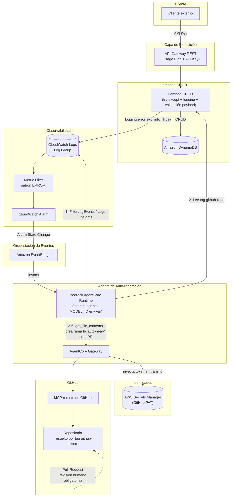

# Guía Arquitectónica: Agente Autónomo de Análisis y Remediación Automatizada Serverless y CRUD de Base de Datos

## 1. Contexto del Proyecto

Este repositorio contiene las funciones AWS Lambda encargadas de ejecutar operaciones CRUD que interactúan de forma directa con Amazon DynamoDB, expuestas públicamente a través de un Amazon API Gateway. Adicionalmente, el proyecto define la infraestructura para un Agente de DevOps de Auto-reparación (Self-Healing Agent) que se activa cuando CloudWatch detecta un error de ejecución en estas Lambdas, a través de EventBridge.

Todo el proyecto (Lambdas CRUD, API Gateway, EventBridge, Alarmas, y la infraestructura del Agente) se despliega como Infraestructura como Código (IaC) usando **AWS CDK en Python**. Queda prohibido generar plantillas manuales de CloudFormation o cualquier otro framework de IaC distinto de CDK/Python para este proyecto.

## 2. Arquitectura del Agente de Auto-reparación (Stricto Sensu)

Cuando ocurra un error y sea necesario generar una solución, el diseño debe ser 100% Serverless. Queda estrictamente **PROHIBIDO** sugerir arquitecturas basadas en contenedores autogestionados o registries de imágenes (como AWS ECS, Fargate, EC2 o ECR), tanto para el Agente como para las Lambdas CRUD. Se deben seguir los siguientes patrones de desarrollo:

- **Framework de Agentes:** Utilizar el SDK de `strands-agents` en Python.
- **Entorno de Ejecución:** Amazon Bedrock AgentCore Runtime (entorno serverless administrado).
- **Modelo LLM:** El identificador del modelo (`model_id`) **debe** ser configurable vía variable de entorno `MODEL_ID`, nunca hardcodeado, para permitir su cambio sin redeploy de código. El valor por defecto en ausencia de la variable es `qwen.qwen3-coder-30b-a3b-instruct`.
- **Protocolo de Herramientas:** Utilizar Model Context Protocol (MCP) para interactuar con GitHub.
- **Conectividad Externa:** Apuntar al MCP remoto oficial de GitHub.
- **Enrutamiento:** Conectar las llamadas mediante el AgentCore Gateway de AWS, que actúa como intermediario autenticado hacia el MCP remoto de GitHub.

### 2.1. Diagrama de Arquitectura

**Leyenda del flujo del Agente:**
1. La Alarm State Change llega al Agente vía EventBridge (solo metadata).
2. El Agente consulta CloudWatch Logs para obtener el stack trace real.
3. El Agente lee el tag `github-repo` de la Lambda afectada para resolver `owner/repo`.
4. El Agente, a través de AgentCore Gateway (que inyecta el PAT desde Secrets Manager de forma efímera), invoca el MCP remoto de GitHub para leer el código, generar el parche, crear la rama `fix/auto-heal-{lambda}-{timestamp}` desde `main`, y abrir el Pull Request.
5. El PR queda pendiente de revisión y aprobación humana; no hay merge automático.

### 2.2. Gestión de Identidades y Secretos

- El Token de Acceso Personal (PAT) de GitHub debe almacenarse en **AWS Secrets Manager**. Este es un componente obligatorio de la arquitectura.
- El AgentCore Gateway es el componente responsable de recuperar el PAT desde Secrets Manager e inyectarlo efímeramente en tránsito en cada llamada al MCP de GitHub.
- El código de la Lambda/Agente **jamás** debe leer o tener acceso directo al PAT en texto plano (ni por variable de entorno ni por ningún otro medio). El Agente solo invoca herramientas MCP; nunca manipula el token.

### 2.3. Resolución del Repositorio Objetivo

- Cada Lambda CRUD debe estar etiquetada (tag) con la clave `github-repo`, cuyo valor debe seguir el formato `owner/repo` (ejemplo: `mi-org/mi-lambda-crud`).
- El Agente **no** debe escanear ni buscar entre repositorios accesibles por el PAT. El nombre del repositorio a corregir se obtiene siempre leyendo este tag de la Lambda que generó el error, y luego se usa el MCP de GitHub únicamente para operar sobre ese repositorio específico (leer archivos, crear rama, crear PR).
- Esta restricción reduce el radio de exposición del PAT: el Agente opera exclusivamente sobre el repositorio indicado por el tag, nunca sobre un universo abierto de repositorios.

### 2.4. Gestión de Ramas y Pull Requests

- El Agente genera el parche de código completo de forma autónoma (no delega la generación del fix a terceros).
- La rama de corrección debe crearse siempre desde `main`, siguiendo el patrón de nombre: `fix/auto-heal-{lambda}-{timestamp}`.
- El Agente escribe el contenido del parche directamente (vía herramientas MCP de creación/actualización de archivos) y abre el Pull Request él mismo.
- **Prohibido en todos los casos:** el Agente, o cualquier código generado, nunca debe hacer merge automático de un Pull Request. La revisión y aprobación de todo cambio generado por el Agente es siempre humana y manual. Esta regla no admite excepciones ni flags de configuración que la desactiven.

## 3. Estándares para el Código de las Lambdas CRUD (DynamoDB)

Todas las funciones Lambda destinadas al ciclo CRUD deben cumplir las siguientes reglas:

- **Estructura Defensiva:** Implementar bloques estrictos de `try-except` (Python) en cada handler y en cada operación de I/O contra DynamoDB.
- **Logging:** Utilizar el módulo estándar `logging` de Python (no `print()`). Cualquier fallo controlado o no controlado debe registrarse con `logging.error(..., exc_info=True)`, de forma que el mensaje resultante en stdout/CloudWatch Logs contenga el prefijo `ERROR:` seguido del stack trace detallado. Este formato es el que consume el CloudWatch Metric Filter para detectar anomalías; no debe alterarse sin actualizar también el Metric Filter correspondiente.
- **Validación de Payloads:** Validar que los parámetros del evento (ej. `partition_key`, atributos del body) existan y tengan el tipo esperado antes de procesar operaciones, evitando fallos del tipo `KeyError` o `TypeError`.
- **Despliegue:** Cada Lambda se empaqueta y despliega de forma 100% serverless (zip o layers de Python), sin contenedores ni imágenes de ECR.

## 4. Exposición Pública (API Gateway)

- Las Lambdas CRUD se exponen a través de un **Amazon API Gateway (REST API)**, usando **Usage Plan + API Key** como mecanismo de autenticación.
- Esta decisión es un alcance aceptado explícitamente para el contexto de Hackathon: API Key ofrece control de acceso simple y throttling por cliente, pero no es un mecanismo de autenticación robusto (no cifra ni rota automáticamente, viaja como header estático). No se recomienda para un entorno de producción sin evolucionar hacia autenticación IAM (SigV4) o Amazon Cognito.
- No sugerir ni introducir HTTP API con Lambda Authorizer, IAM auth o Cognito para este proyecto salvo que el usuario lo solicite explícitamente como cambio de alcance.

## 5. Flujo Operativo del Agente ante un Error

Cada vez que generes código para el Agente, el ciclo autónomo de Razonamiento y Acción (ReAct) debe seguir estos pasos en orden:

1. **Detectar:** CloudWatch Metric Filter (patrón `ERROR:`) sobre el Log Group de la Lambda dispara una CloudWatch Alarm. El cambio de estado de la alarma se publica como evento nativo en EventBridge, que invoca al Agente.
2. **Analizar:** El evento de EventBridge trae únicamente metadata de la alarma (no el stack trace). El Agente debe consultar CloudWatch Logs (`FilterLogEvents` o Logs Insights) sobre el Log Group correspondiente para obtener el log de error más reciente y su stack trace completo.
3. **Identificar el repositorio:** El Agente lee el tag `github-repo` de la Lambda involucrada para determinar el `owner/repo` exacto a corregir (ver sección 2.3).
4. **Invocar** la herramienta del MCP remoto de GitHub (`repos.get_file_contents`) para leer el código fuente con el bug, dentro del repositorio identificado en el paso anterior.
5. **Generar** el parche de código completo aplicando programación defensiva (try-except, validación de payloads, logging estándar) sin romper la lógica CRUD de DynamoDB.
6. **Abrir** una nueva rama desde `main` con el patrón `fix/auto-heal-{lambda}-{timestamp}`, escribir el parche, e invocar la herramienta MCP de creación de Pull Request para someter la solución a revisión humana obligatoria (ver sección 2.4). Nunca aprobar ni mergear el PR de forma automática.

## 6. Notas de Alcance (Hackathon)

- La arquitectura de detección de errores usa el flujo "Alarm → EventBridge → consulta posterior a CloudWatch Logs" (no un Subscription Filter con Lambda enrutadora). Es una decisión deliberada para mantener el número de componentes acotado durante el Hackathon.
- La autenticación del API Gateway vía API Key es una decisión de simplicidad para el Hackathon, documentada como riesgo aceptado (ver sección 4).
- El repositorio objetivo del Agente se resuelve por tag de la Lambda, no por búsqueda dinámica entre repositorios del PAT.
